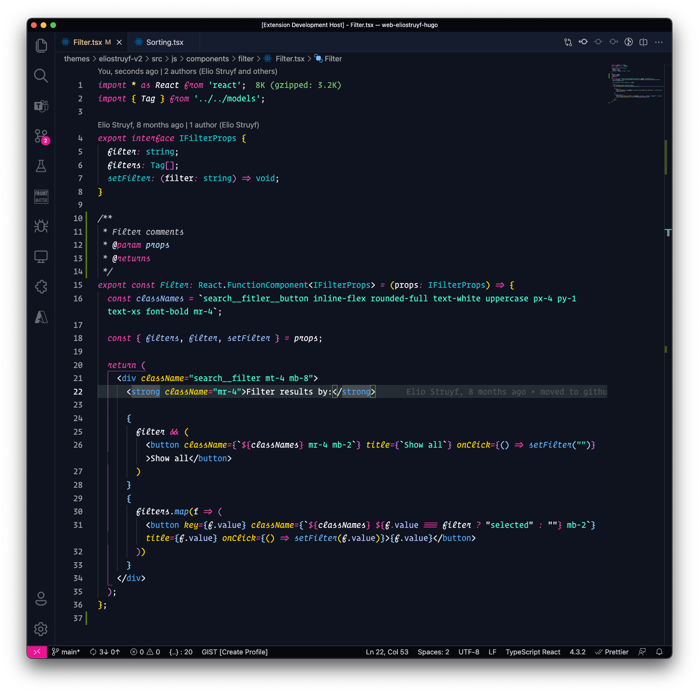

  

<h1 align="center">The unnamed</h1>

  

  
  
  

In June 2021, I had a bike accident, and I broke one vertebra. The doctor prescribed rest, but that is so boring. Lucky enough, my body tells me I need this rest. 

As working was hard, I could only sit for 20 minutes; I started looking for something to do. That is how I came up with creating a new Visual Studio Code theme.

I have already created various Code extensions, but I never took the time to explore how to make themes.

Currenty the theme is available with and without italics.

## Colors

I love colors. That is why I wanted to have a dark theme with vivid colors. 

The primary color for the theme will be: `#F141A8`. From this color, all other colors are derived.

### Main colors

  

    

    
Main Accent: <code>#F141A8</code>
  

  

    

    
Background: <code>#0E131F</code>
  

  

    

    
Foreground: <code>#F3EFF5</code>
  

### Accent colors

  

    

    
Accent: <code>#FFE45E</code>
  

  

    

    
Accent: <code>#44FFD2</code>
  

  

    

    
Accent: <code>#15C2CB</code>
  

  

    

    
Accent: <code>#5EADF2</code>
  

  

    

    
Accent: <code>#FE4A49</code>
  

## Usage

Select the `The unnamed` or `The unnamed (No Italics)` from the theme menu in VSCode.

## Installation

1. Open **Extensions** sidebar panel in Visual Studio Code. `View → Extensions`
1. Search for `The unnamed`
1. Click **Install**
1. Click **Reload**
1. File > Preferences > Color Theme > **The unnamed** or **The unnamed (No Italics)**
1. Enjoy using the theme

## Contributing

I hope you like the theme and enjoy using it. If you encounter an issue, or have some feedback, feel free to contribute by sending in a PR or an issue at the [The unnamed repository](https://github.com/estruyf/vscode-unnamed-theme).

  

