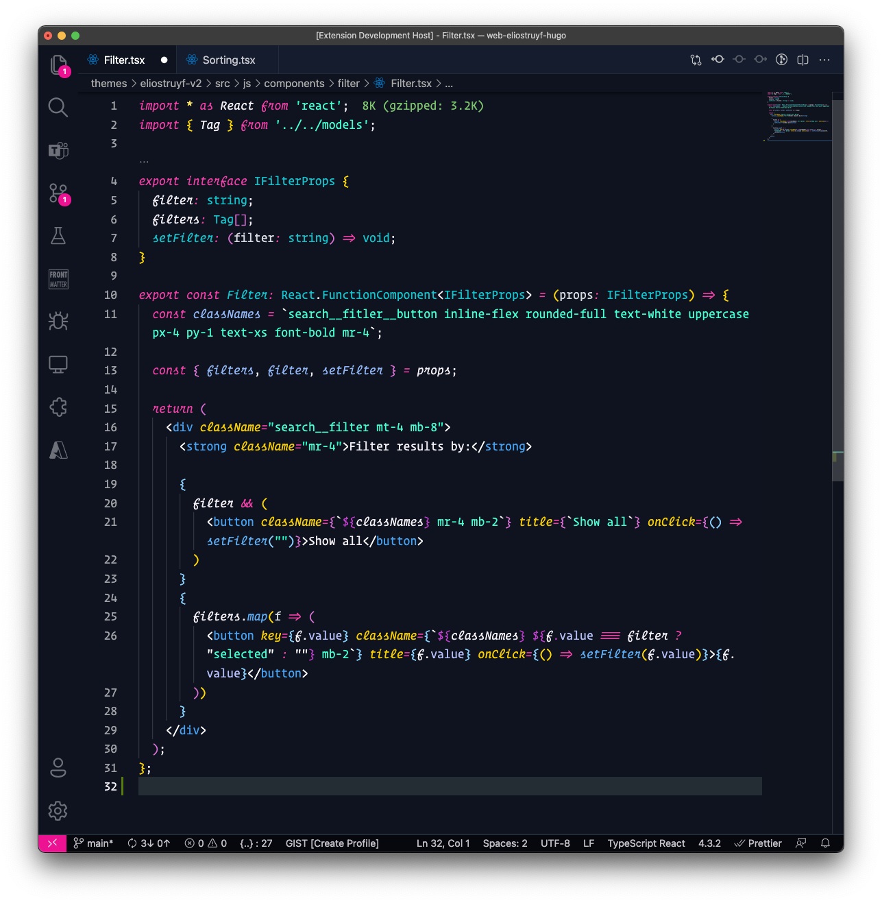

# The unnamed theme for VSCode

In June 2021, I had a bike accident, and I broke one vertebra. The doctor prescribed rest, but that is so boring. Lucky enough, my body tells me I need this rest. 

As working was hard, I could only sit for 20 minutes; I started looking for something to do. That is how I came up with creating a new Visual Studio Code theme.

I have already created various Code extensions, but I never took the time to explore how to make themes.

## Colors

I love colors. That is why I wanted to have a dark theme with bright colors. 

The primary color for the theme will be: `#F141A8`. From this color, all other colors are derived.

- Background: `#0E131F`
- Foreground: `#F3EFF5`
- Secondary 1: `#FFE45E`
- Secondary 2: `#50E3C2`
- Secondary 3: `#15C2CB`
- Secondary 4: `#5EADF2`
- Secondary 5: `#FE4A49`

## Contributing

If you like the theme, feel free to contribute to it.